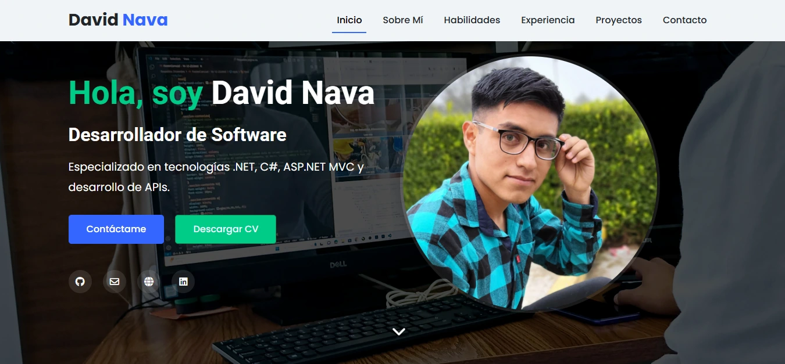

# Portafolio Web - David Nava



## 📋 Descripción

Este proyecto es un portafolio web profesional y responsive desarrollado para mostrar mis habilidades, experiencia y proyectos como Desarrollador de Software. Actualzado a una versión 2.

## ✨ Características

- **Diseño Responsive**: Compatible con dispositivos móviles, tablets y escritorio
- **Navegación Fluida**: Menú intuitivo con smooth scrolling
- **Secciones Completas**: Presentación, sobre mí, habilidades, experiencia, proyectos y contacto
- **Filtrado de Proyectos**: Sistema de filtrado por categorías (Web, ASP.NET, APIs)
- **Modales Detallados**: Información completa de cada proyecto con imágenes y descripciones
- **Integración con Redes**: Enlaces a GitHub, LinkedIn y correo electrónico
- **Descarga de CV**: Opción para descargar currículum en formato PDF

## 🛠️ Tecnologías Utilizadas

- **HTML5**: Estructura semántica y moderna
- **CSS3**: Estilos personalizados y animaciones
- **JavaScript**: Interactividad y manipulación del DOM
- **Bootstrap 5**: Framework CSS para diseño responsive
- **Font Awesome**: Íconos vectoriales
- **Google Fonts**: Tipografías personalizadas
- **Devicons**: Íconos para tecnologías y herramientas
- **EmailJS**: Funcionalidad de formulario de contacto

## 🚀 Uso

1. **Clonar el repositorio**:
   ```bash
   git clone https://github.com/DavidNva/PortafolioWeb.git
   ```

2. **Abrir el proyecto**:
   - Navega al directorio del proyecto
   - Abre el archivo `index.html` en tu navegador

3. **Desarrollo local**:
   - Para desarrollo, se recomienda usar un servidor local como Live Server en VSCode

## 📁 Estructura del Proyecto

```
/
├── index.html                # Archivo principal
├── styles.css                # Estilos personalizados
├── scripts.js                # Funcionalidades JavaScript
├── images/                   # Imágenes del sitio y proyectos
│   ├── perfil_original.jpg
│   └── [imágenes de proyectos]
└── files/                    # Archivos descargables como el CV
    └── CV_Nombre_Desarrollador_Software_Tecnologia.pdf
```

## 📱 Secciones del Portafolio

1. **Inicio**: Presentación personal con foto y enlaces de contacto
2. **Sobre Mí**: Información profesional y personal
3. **Habilidades**: Tecnologías dominadas y herramientas utilizadas
4. **Experiencia y Educación**: Historial profesional y formación académica
5. **Proyectos**: Galería de proyectos con sistema de filtrado
6. **Contacto**: Formulario para comunicación directa

## 🌐 Proyectos Destacados

- **Sistema de Gestión de Préstamos y Laboratorios - ITSSNP**: Plataforma institucional para administrar préstamos de herramientas y gestionar laboratorios
- **Chatbot Inteligente con WhatsApp y ChatGPT**: API que conecta WhatsApp con bases de datos mediante consultas en lenguaje natural
- **API de Procesamiento de Documentos PDF**: Herramienta para extraer y analizar información de documentos PDF con IA
- **Sistema de Gestión de Biblioteca**: Aplicación web para administrar préstamos de libros en una biblioteca pública
- **Integración de PayPal con ASP.NET MVC**: Implementación de pagos en línea con PayPal

## 👨‍💻 Personalización

Para personalizar este portafolio:

1. Modifica el archivo `index.html` para actualizar la información personal
2. Actualiza las imágenes en la carpeta `images/` con tus propias fotos
3. Cambia los estilos en `styles.css` para ajustar colores y diseño
4. Reemplaza los proyectos en la sección correspondiente

## 📞 Contacto

- **Email**: david.nava.garcia4@gmail.com
- **LinkedIn**: [david-nava-garcia](https://www.linkedin.com/in/david-nava-garcia/)
- **GitHub**: [DavidNva](https://github.com/DavidNva)
- **Web**: [davidnavadev.netlify.app](https://davidnavadev.netlify.app)

## 📄 Licencia

Este proyecto está disponible como código abierto bajo los términos de la licencia MIT.

---

Desarrollado por David Nava © 2024